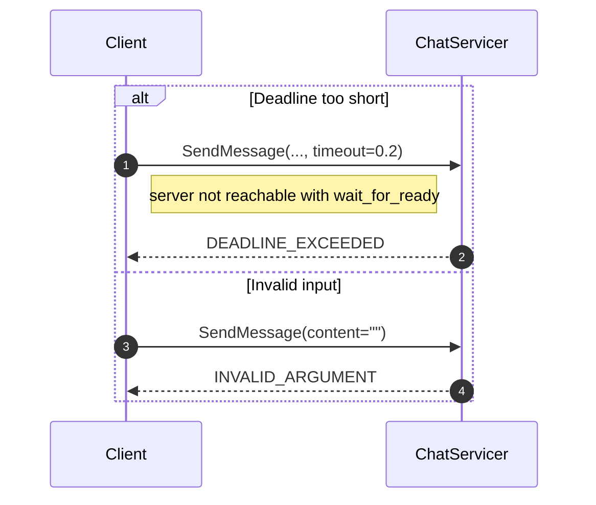

# Exercise 6: Deadlines and Error Handling 

## Goal

Learn how to make gRPC clients more resilient by handling:
- **Deadlines** (`DEADLINE_EXCEEDED`)
- **Status-based errors** (for example `INVALID_ARGUMENT`)

## Context

In real systems, RPCs can fail for many reasons:
- server is slow or unavailable
- caller gives invalid input

Your client should classify failures by **status code** and react cleanly.

## Message flow



## Your task

Open `deadlines_starter.py` and fill in `demo_deadline_exceeded` and
`demo_invalid_argument`.

### Task 1 — Deadline demo

1. Open an `insecure_channel` to `UNREACHABLE_SERVER` (use a context manager)
2. Create a `ChatServiceStub`
3. Call `stub.SendMessage(...)` with a `MessageRequest`, passing `timeout=0.2`
   and `wait_for_ready=True`
4. Catch `grpc.RpcError` and print `error.code()`

`wait_for_ready=True` tells gRPC to keep retrying the connection instead of
failing fast with `UNAVAILABLE` — that's what turns this into a
`DEADLINE_EXCEEDED` once the timeout elapses.

### Task 2 — Error handling demo

The channel and stub are already created for you against `EXERCISE_SERVER`:

1. Call `stub.SendMessage(...)` with an empty `content`
2. Catch `grpc.RpcError` and print both `error.code()` and `error.details()`

## Run it

```bash
# Terminal 1
poe server

# Terminal 2
poe starter-06
```

## ✅ Micro-check

You should see output similar to:

```text
[Deadline] code=DEADLINE_EXCEEDED
[Error] code=INVALID_ARGUMENT details=Message content cannot be empty
```

If deadline shows `UNAVAILABLE`, check that your call uses `wait_for_ready=True`.

